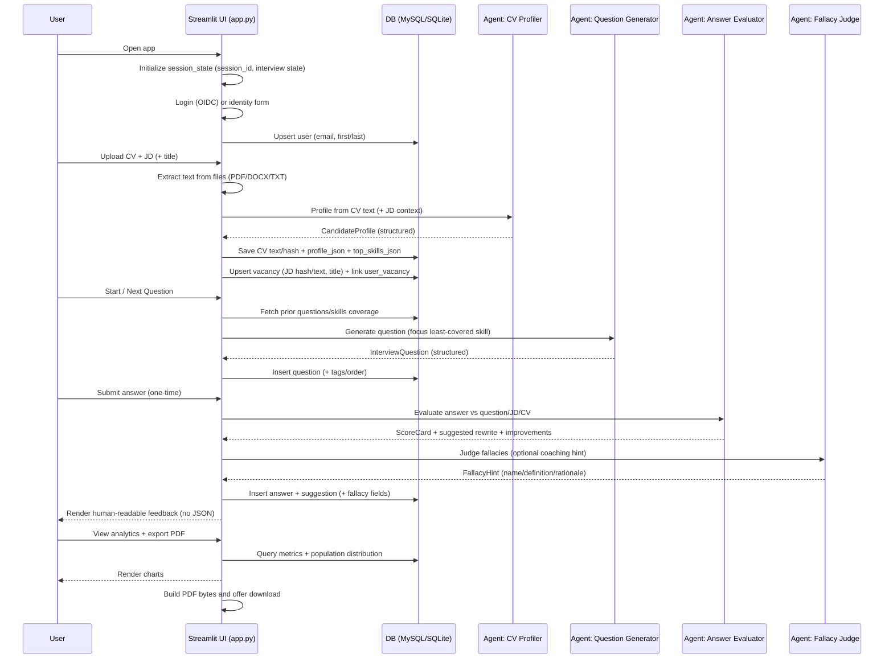

## Aporia - Interview Practice Coach (Streamlit + PydanticAI + MySQL)

A polished, single-page Streamlit app for practicing interview questions with human-readable, structured feedback, skill-coverage guidance, and optional fallacy/logic coaching. It supports local development, MySQL persistence (Docker Compose), and an app-only container that's Cloud Run friendly.

## Demo features

- CV + Job Description upload (PDF/DOCX/TXT) with automatic parsing
- Interview loop: generate question → submit once → skip/next question
- Feedback: relevance, correctness, improvements, suggested rewrite, red flags
- Fallacy ribbon with "read more" explanations + uncertainty disclaimer
- Top-10 skill coverage tracking to diversify questions
- Analytics dashboard (charts + population comparison) + PDF export
- Persistence: SQLite fallback for quick local runs; MySQL via env vars

## Architecture

- `interview_coach/app.py`: Streamlit UI + orchestration
- `interview_coach/interview_app/agents/`: PydanticAI-backed agents (question generation, evaluation, fallacy judging, CV profiling)
- `interview_coach/interview_app/db.py`: persistence layer (MySQL when configured, otherwise SQLite)
- `interview_coach/interview_app/services/`: parsing, safety checks, skill-coverage logic, fallacy formatting
- `interview_coach/interview_app/charts.py`: embedded charts for analytics
- `interview_coach/interview_app/pdf_report.py`: PDF report generation
- `interview_coach/interview_app/logging_setup.py`: stdout + rotating file logs

## End-to-end flow (how the app works)

This is the full “happy path” flow from a user opening the app to exporting a PDF report.

### System flowchart

```mermaid
flowchart TD
  U[User] --> UI[Streamlit UI<br/>interview_coach/app.py]

  UI --> AUTH[Auth layer<br/>Streamlit OIDC st.login/st.user<br/>or one-time identity form]
  AUTH --> DB[(DB<br/>MySQL when configured<br/>else SQLite fallback)]

  UI --> UPLOADS[Uploads<br/>CV + JD]
  UPLOADS --> PARSE[Text extraction<br/>PDF/DOCX/TXT]
  PARSE --> AGENTS[Agents (PydanticAI)]

  AGENTS --> CVPROF[CV Profiler]
  AGENTS --> QGEN[Question Generator<br/>+ skill coverage]
  AGENTS --> EVAL[Answer Evaluator]
  AGENTS --> FALLACY[Fallacy Judge]

  CVPROF --> DB
  QGEN --> DB
  EVAL --> DB
  FALLACY --> DB

  UI --> INTERVIEW[Interview loop<br/>submit once / skip / next]
  INTERVIEW --> DB

  UI --> ANALYTICS[Analytics dashboard<br/>charts + stats]
  ANALYTICS --> DB
  ANALYTICS --> PDF[PDF generator]
  PDF --> REPORT[Download + optional save path]

  DB --> ANALYTICS
  DB --> UI
```

### Interview session sequence



## Core components (what each piece does)

### UI / Orchestration (`interview_coach/app.py`)

- Owns Streamlit page layout, session state, and the interview state machine.
- Gating: requires CV + JD upload before interview; “submit answer” is one-time per question; “skip” persists a skipped record.
- Renders only human-friendly fields (no raw JSON).

### Persistence layer (`interview_coach/interview_app/db.py`)

- Chooses **MySQL** when `MYSQL_HOST`/`MYSQL_DATABASE`/`MYSQL_USER`/`MYSQL_PASSWORD` are set, otherwise uses **SQLite** files under `interview_coach/.data/`.
- Stores: users, vacancies (JDs), user-vacancy links, questions, answers, suggestions, and analytics aggregations.

### Agents (`interview_coach/interview_app/agents/`)

- **CV Profiler**: converts CV text into a structured `CandidateProfile` used to tailor questions and feedback.
- **Question Generator**: generates interview questions and tags them with skill focus; uses a least-covered strategy to rotate through top skills.
- **Answer Evaluator**: produces structured scoring (relevance/correctness), improvements, red flags, and a suggested rewrite.
- **Fallacy Judge**: optionally flags likely fallacies and provides a coaching-style explanation and disclaimer.

### Services (`interview_coach/interview_app/services/`)

- Upload parsing + hashing, safety checks, fallacy formatting, and skill-coverage logic used by the UI/agents.

### Analytics + PDF

- Analytics queries compute per-user metrics and (optionally) compare to population aggregates.
- Charts render inside Streamlit (`interview_coach/interview_app/charts.py`).
- PDF report generation produces a downloadable report (`interview_coach/interview_app/pdf_report.py`).

## Quickstart (local, SQLite fallback)

Prereqs: Python 3.11+ and `uv`.

```bash
uv sync
uv run streamlit run interview_coach/app.py
```

App: `http://localhost:8501`

## Configuration

The app reads configuration from environment variables (and will also load a local `.env` if present).

- `OPENAI_API_KEY`: required for LLM calls
- Optional MySQL (enables shared persistence + analytics across users):
  - `MYSQL_HOST`, `MYSQL_PORT` (default `3306`), `MYSQL_DATABASE`, `MYSQL_USER`, `MYSQL_PASSWORD`

Copy and edit the template:

```bash
cp .env.example .env
```

## Docker Compose (local MySQL + app)

Prereqs: Docker Desktop (Compose v2).

```bash
docker compose up --build
```

- App: `http://localhost:8501`
- MySQL: `localhost:3306` (DB/user/password default to `aporia`/`aporia`/`aporia` in `docker-compose.yml`)

## Cloud Run-ready container (app-only)

This repo ships an **app-only** container image. Configure your database using environment variables (e.g., Cloud SQL for MySQL) when deploying.

Build + run locally:

```bash
docker build -t aporia:latest .
docker run --rm -p 8080:8080 -e PORT=8080 -e OPENAI_API_KEY=... aporia:latest
```

Then open `http://localhost:8080`.

## Testing

```bash
uv run pytest -q
```

## Notes on auth (Streamlit native OIDC)

If Streamlit OIDC is configured, the app will call `st.login()` and use `st.user`. If not, it falls back to a one-time "Complete your profile" form and stores the identity in the DB.

## Repository structure

- `interview_coach/`: main application package + tests
- `docker-compose.yml`: local MySQL + app
- `Dockerfile`: app-only container image (Cloud Run friendly via `PORT`)
- `.env.example`: environment variable template (do not commit real secrets)
