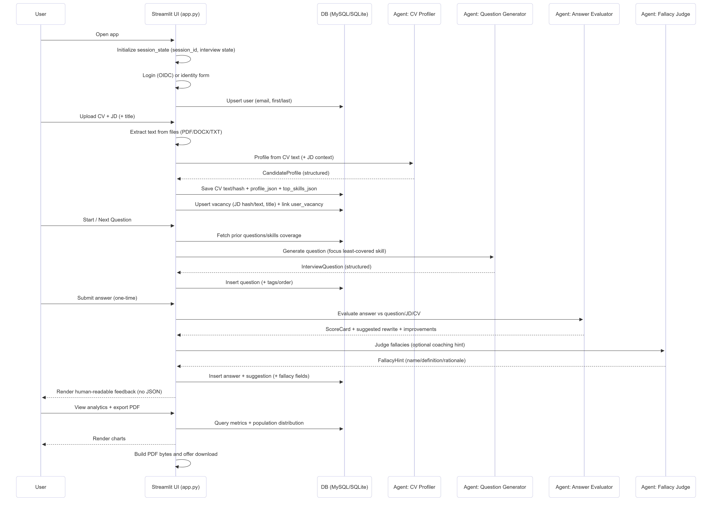
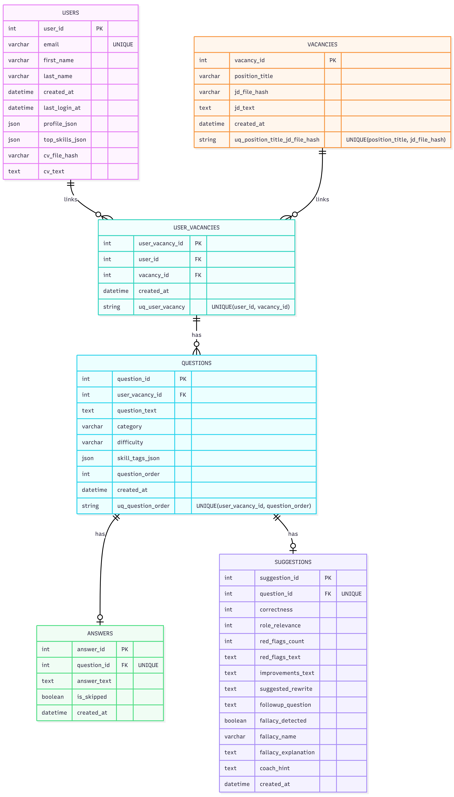
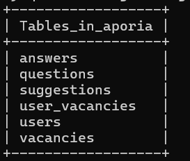
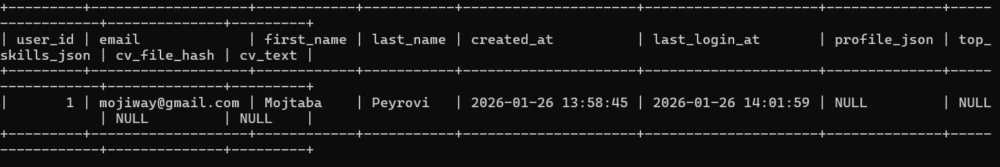

## Aporia - Interview Practice Coach (Streamlit + PydanticAI + MySQL)

A polished, single-page Streamlit app for practicing interview questions with human-readable, structured feedback, skill-coverage guidance, and optional fallacy/logic coaching. It supports local development, MySQL persistence (Docker Compose), and an app-only container that's Cloud Run friendly.

- The app is deployed on Google Cloud Platform and can be found here: https://aporia-396340266386.europe-west10.run.app/
## The Inspiration


This project is inspired by Aristotle’s work on reasoning and argument quality in the *Organon* (especially *Sophistical Refutations*), which catalogues common ways language and logic can mislead. In interviews, those same patterns often show up as unclear claims, overconfident generalizations, or “sounds-right” explanations that don’t actually answer the question.

In Aporia, your answer can be scanned for likely fallacy patterns. When one is detected, the app shows a **Fallacy Detected** ribbon plus a “read more” explanation (definition, why the answer matches the pattern, why it can be a red flag in interviews, and a disclaimer that this is probabilistic coaching—not a truth-judgement).

### Why the name “Aporia”?

In philosophy, **aporia** is a state of puzzlement or an “impasse” where a contradiction, ambiguity, or gap in reasoning is revealed. That’s exactly the moment good coaching targets: turning confusion into clarity, and replacing fragile reasoning with a grounded, interview-ready explanation.

### The 13 fallacies (Aristotle) — meaning + interview-style example

Aristotle’s catalogue is commonly summarized as **13 fallacies**: **6 “in language”** (due to wording) and **7 “outside language”** (due to reasoning).

#### Fallacies “in language” (in dictione)

1) **Equivocation**
   - Meaning: one word/phrase used in two different senses.
   - Example: “I’m *transparent* as a leader—everyone can see through me.” (transparent = open vs easily defeated)
   - In the app: flagged when a key term (“ownership”, “lead”, “impact”, “scale”) shifts meaning mid-answer.

2) **Amphiboly**
   - Meaning: ambiguous grammar/sentence structure creates multiple readings.
   - Example: “I improved the model with my manager.” (did you improve it together, or for your manager?)
   - In the app: flagged when phrasing makes responsibility or causality unclear; the suggestion typically rewrites for clarity.

3) **Composition**
   - Meaning: attributes of parts are wrongly applied to the whole.
   - Example: “Each component is secure, so the system is secure.”
   - In the app: flagged when you infer a system-level guarantee from isolated successes without integration evidence.

4) **Division**
   - Meaning: attribute of the whole is wrongly applied to each part.
   - Example: “Our team is high-performing, so every project I did was high-performing.”
   - In the app: flagged when you imply personal or component-level excellence solely from team/company reputation.

5) **Accent**
   - Meaning: meaning changes based on emphasis/quotation/context.
   - Example: “I *only* changed configuration.” (minimizes impact; the emphasis changes accountability)
   - In the app: flagged when selective emphasis or quoted phrasing is used to dodge the core question; coaching nudges a direct answer.

6) **Form of expression (Figure of speech)**
   - Meaning: grammatical form misleads (e.g., treating “looks like X” as “is X”).
   - Example: “This seems optimal, therefore it is optimal.”
   - In the app: flagged when hedged language (“seems”, “probably”) is presented as a firm conclusion without support.

#### Fallacies “outside language” (extra dictionem)

7) **Accident**
   - Meaning: applying a general rule to a special case where it doesn’t fit.
   - Example: “We always ship fast, so skipping QA here was fine.”
   - In the app: flagged when a rule of thumb replaces situational judgment; coaching asks for constraints/tradeoffs.

8) **Qualified vs absolute (Secundum quid et simpliciter)**
   - Meaning: moving from “in some respect” to “absolutely”.
   - Example: “Latency dropped in one scenario, so the system is faster.”
   - In the app: flagged when scope/conditions are missing; suggestion adds boundaries (“under X load”, “for Y cohort”).

9) **Ignoratio elenchi (Irrelevant conclusion)**
   - Meaning: answering a different question than the one asked.
   - Example: Asked: “Why did it fail?” Answer: “We worked really hard and learned a lot.”
   - In the app: flagged when the answer is off-target; coaching pushes a tight structure: cause → evidence → fix → result.

10) **Begging the question (Petitio principii)**
   - Meaning: the conclusion is assumed in the premises.
   - Example: “I’m qualified because I’m the best person for the role.”
   - In the app: flagged when claims are self-justifying; suggestion adds concrete evidence (metrics, decisions, tradeoffs).

11) **Affirming the consequent**
   - Meaning: “If P then Q; Q; therefore P.”
   - Example: “Strong teams have high uptime; we have high uptime; therefore our process is strong.”
   - In the app: flagged when correlation is treated as proof; coaching asks for alternative explanations and direct causality.

12) **False cause (Non causa pro causa)**
   - Meaning: treating something as the cause when it isn’t (mistaken cause).
   - Example: “We refactored and then revenue rose, so the refactor caused the revenue increase.”
   - In the app: flagged when post-hoc storytelling appears; suggestion adds validation steps (A/B, controlled rollout, attribution).

13) **Many questions (Complex question)**
   - Meaning: a loaded multi-part question that forces hidden assumptions.
   - Example: “How did you fix the bug and why did your design cause it in the first place?”
   - In the app: flagged when the question (or your answer) bundles multiple claims; coaching recommends decomposing and answering parts explicitly.

## Demo features

- CV + Job Description upload (PDF/DOCX/TXT) with automatic parsing
- Interview loop: generate question → submit once → skip/next question
- Feedback: relevance, correctness, improvements, suggested rewrite, red flags
- Fallacy ribbon with "read more" explanations + uncertainty disclaimer
- Top-10 skill coverage tracking to diversify questions
- Analytics dashboard (charts + population comparison) + PDF export
- Persistence: SQLite fallback for quick local runs; MySQL via env vars

## Architecture

- `interview_coach/app.py`: Streamlit UI + orchestration
- `interview_coach/interview_app/agents/`: PydanticAI-backed agents (question generation, evaluation, fallacy judging, CV profiling)
- `interview_coach/interview_app/db.py`: persistence layer (MySQL when configured, otherwise SQLite)
- `interview_coach/interview_app/services/`: parsing, safety checks, skill-coverage logic, fallacy formatting
- `interview_coach/interview_app/charts.py`: embedded charts for analytics
- `interview_coach/interview_app/pdf_report.py`: PDF report generation
- `interview_coach/interview_app/logging_setup.py`: stdout + rotating file logs

## End-to-end flow (how the app works)

This is the full “happy path” flow from a user opening the app to exporting a PDF report.

### System flowchart


### Interview session sequence




### ER Diagram


## Core components (what each piece does)

### UI / Orchestration (`interview_coach/app.py`)

- Owns Streamlit page layout, session state, and the interview state machine.
- Gating: requires CV + JD upload before interview; “submit answer” is one-time per question; “skip” persists a skipped record.
- Renders only human-friendly fields (no raw JSON).

### Persistence layer (`interview_coach/interview_app/db.py`)

- Chooses **MySQL** when `MYSQL_HOST`/`MYSQL_DATABASE`/`MYSQL_USER`/`MYSQL_PASSWORD` are set, otherwise uses **SQLite** files under `interview_coach/.data/`.
- Stores: users, vacancies (JDs), user-vacancy links, questions, answers, suggestions, and analytics aggregations.

### Agents (`interview_coach/interview_app/agents/`)

- **CV Profiler**: converts CV text into a structured `CandidateProfile` used to tailor questions and feedback.
- **Question Generator**: generates interview questions and tags them with skill focus; uses a least-covered strategy to rotate through top skills.
- **Answer Evaluator**: produces structured scoring (relevance/correctness), improvements, red flags, and a suggested rewrite.
- **Fallacy Judge**: optionally flags likely fallacies and provides a coaching-style explanation and disclaimer.

### Services (`interview_coach/interview_app/services/`)

- Upload parsing + hashing, safety checks, fallacy formatting, and skill-coverage logic used by the UI/agents.

### Analytics + PDF

- Analytics queries compute per-user metrics and (optionally) compare to population aggregates.
- Charts render inside Streamlit (`interview_coach/interview_app/charts.py`).
- PDF report generation produces a downloadable report (`interview_coach/interview_app/pdf_report.py`).

## Quickstart (local, SQLite fallback)

Prereqs: Python 3.11+ and `uv`.

```bash
uv sync
uv run streamlit run interview_coach/app.py
```

App: `http://localhost:8501`

## Configuration

The app reads configuration from environment variables (and will also load a local `.env` if present).

- `OPENAI_API_KEY`: required for LLM calls
- Optional MySQL (enables shared persistence + analytics across users):
  - `MYSQL_HOST`, `MYSQL_PORT` (default `3306`), `MYSQL_DATABASE`, `MYSQL_USER`, `MYSQL_PASSWORD`

Copy and edit the template:

```bash
cp .env.example .env
```

## Docker Compose (local MySQL + app)

Prereqs: Docker Desktop (Compose v2).

```bash
docker compose up --build
```

- App: `http://localhost:8501`
- MySQL: `localhost:3306` (DB/user/password default to `aporia`/`aporia`/`aporia` in `docker-compose.yml`)

## Cloud Run-ready container (app-only)

This repo ships an **app-only** container image. Configure your database using environment variables (e.g., Cloud SQL for MySQL) when deploying.

Build + run locally:

```bash
docker build -t aporia:latest .
docker run --rm -p 8080:8080 -e PORT=8080 -e OPENAI_API_KEY=... aporia:latest
```

Then open `http://localhost:8080`.

## Deployment (GCP Cloud Run)

This app is deployed as an **app-only** container on **Google Cloud Run** (region: `europe-west10`). The container image is stored in **Artifact Registry** and deployed to a Cloud Run service named `aporia`.

Live URL:
- `https://aporia-396340266386.europe-west10.run.app/`

### Tech used

- **Cloud Run**: serverless container runtime (HTTP, autoscaling)
- **Artifact Registry**: Docker image storage
- **Cloud Build**: builds the Docker image from this repo and pushes it to Artifact Registry
- Optional **Cloud SQL (MySQL)**: recommended persistent database in production (configured via env vars)

### Deploy/update steps (CLI)

Prereqs: `gcloud` installed, authenticated, and the project set.

```bash
gcloud config set project PROJECT_ID
gcloud services enable run.googleapis.com artifactregistry.googleapis.com cloudbuild.googleapis.com
```

Build + push:

```bash
gcloud builds submit --tag REGION-docker.pkg.dev/PROJECT_ID/aporia/aporia:latest
```

Deploy:

```bash
gcloud run deploy aporia \
  --image REGION-docker.pkg.dev/second-try-ml/aporia/aporia:latest \
  --region REGION \
  --port 8080 \
  --allow-unauthenticated
```

Configure env vars (minimum required):

```bash
gcloud run services update aporia \
  --region REGION \
  --set-env-vars OPENAI_API_KEY=sk-...
```

Get the service URL:

```bash
gcloud run services describe aporia --region REGION --format="value(status.url)"
```


## Testing

```bash
uv run pytest -q
```

## Query the data on MySQL
1) Start MySQL + app:
```
docker compose up -d
```
2) Check they’re running
```
docker compose ps
```

3) If Mysql is healthy, query it:

To see all tables
```
docker compose exec mysql mysql -u aporia -paporia -D aporia -e "SHOW TABLES;"
```



To see all users:
```
ompose exec mysql mysql -u aporia -paporia -D aporia -e "SELECT * FROM users;"
```



## Notes on auth (Streamlit native OIDC)

If Streamlit OIDC is configured, the app will call `st.login()` and use `st.user`. If not, it falls back to a one-time "Complete your profile" form and stores the identity in the DB.

## Repository structure

- `interview_coach/`: main application package + tests
- `docker-compose.yml`: local MySQL + app
- `Dockerfile`: app-only container image (Cloud Run friendly via `PORT`)
- `.env.example`: environment variable template (do not commit real secrets)
